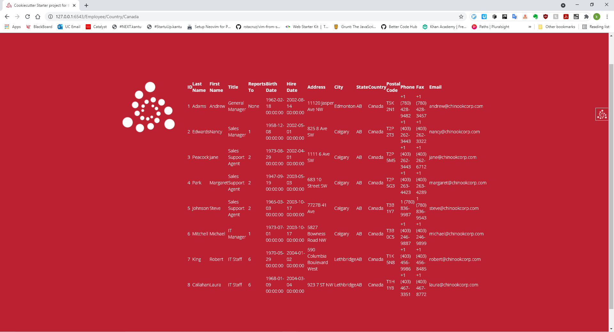
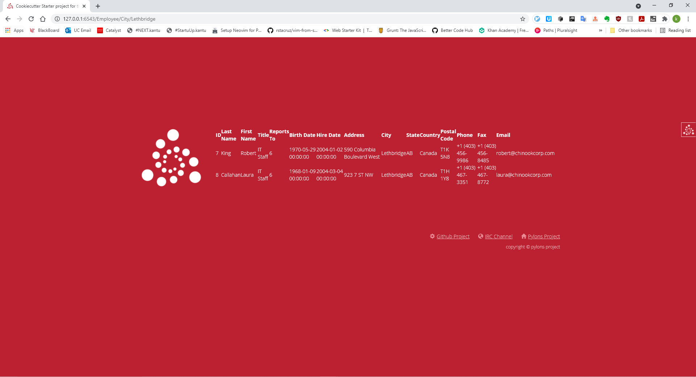

## pyramid_chinook
===============

So I originally went to sort Employees by Country, but found out after I had it set up that all of them are in Canada...
Thankfully the Employees have different cities, so I just made that into a filter and kept the Country one since it isn't hurting anything.

### Index
1. [Examples]
2. [Testing]

#### Examples

Some example links:
http://127.0.0.1:6543/Employee/Country/Canada

http://127.0.0.1:6543/Employee/City/Lethbridge

http://127.0.0.1:6543/Employee/City/Edmonton

#### Testing

Original README Setup Instructions

 

- Change directory into your newly created project if not already there. Your
  current directory should be the same as this README.txt file and setup.py.

    cd pyramid_chinook

- Create a Python virtual environment, if not already created.

    python3 -m venv env

- Upgrade packaging tools, if necessary.

    env/bin/pip install --upgrade pip setuptools

- Install the project in editable mode with its testing requirements.

    env/bin/pip install -e ".[testing]"

- Initialize and upgrade the database using Alembic.

    - Generate your first revision.

        env/bin/alembic -c development.ini revision --autogenerate -m "init"

    - Upgrade to that revision.

        env/bin/alembic -c development.ini upgrade head

- Load default data into the database using a script.

    env/bin/initialize_pyramid_chinook_db development.ini

- Run your project's tests.

    env/bin/pytest

- Run your project.

    env/bin/pserve development.ini

